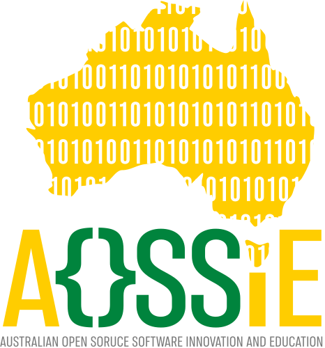

<!-- Don't delete it -->
<div name="readme-top"></div>

<!-- Organization Logo -->
<div align="center" style="display: flex; align-items: center; justify-content: center; gap: 32px;">
  
  
</div>

&nbsp;

<!-- Organization Name & Badges -->
<div align="center">

[](https://resonate.aossie.org/)

</div>

<!-- Organization/Project Social Handles -->
<!-- Organization/Project Social Handles -->
<p align="center">
  <a href="https://t.me/+bMWGzaMTMa8xN2Ex">
    
  </a>
  &nbsp;
  <a href="https://x.com/aossie_org">
    
  </a>
  &nbsp;
  <a href="https://discord.gg/hjUhu33uAn">
    
  </a>
  &nbsp;
  <a href="https://discord.gg/YzDKeEfWtS">
    
  </a>
  &nbsp;
  <a href="https://www.linkedin.com/company/aossie/">
    
  </a>
  &nbsp;
  <a href="https://www.youtube.com/@AOSSIE-Org">
    
  </a>
  &nbsp;
  <a href="https://www.youtube.com/@StabilityNexus">
    
  </a>
</p>

---

<div align="center">
<h1>Resonate Website - Social Voice Platform</h1>
</div>

**Resonate** is an open-source social voice platform, similar to Clubhouse and Twitter Spaces, but completely open-source and community-driven. It aims to enhance credibility within the open-source community, attract users, and foster growth through real-time audio communication.

A high-performance, developer-friendly webpage built on **Next.js 16 (App Router)**, **React 19**, **Tailwind CSS v4**, and pre-configured for **Internationalization (i18n)** and **Localization (l10n)** using **next-intl**.

---

## 🚀 Project Features

- **Real-time Audio Communication:** Interactive live rooms and voice channels for community events.
- **Pair Chatting:** Random partner matching for developer networking.
- **Rooms & Event Management:** Schedule and moderate open-source audio discussions.
- **Multi-language Support (i18n):** Subpath routing (`/en`, `/hi`) with instantaneous client locale switching.
- **Smooth Inertial Scrolling:** High-performance scrolling animations powered by `lenis`.
- **Semantic Dark / Light Theme:** Flash-free color switching using `next-themes` and Tailwind v4 CSS variables.

---

## 💻 Tech Stack

- **Framework:** Next.js 16 (App Router)
- **UI & Logic:** React 19 & TypeScript
- **Styling:** Tailwind CSS v4 (`@tailwindcss/postcss`)
- **Internationalization:** `next-intl`
- **Animations & Motion:** Framer Motion & `lenis` smooth scroll
- **Code Quality:** ESLint & Vitest testing framework

---

## 📋 Project Maturity & Quality Checklist

In the checklist below, mark the items that have been completed for your project:

* [x] The project has a logo (`public/brand/icons/resonate_logo.svg`).
* [x] The project has a favicon (`public/brand/icons/favicon.ico`).
* [x] The web frontend:
   - [x] Has proper title and metadata.
   - [x] Has proper open graph metadata, to ensure that it is shown well when shared in social media.
   - [x] Has a footer and header with AOSSIE logos and social handles.
   - [x] Uses React Server Components by default, introducing Client Components (`"use client"`) only when interactivity or client hooks are required.
   - [x] Is deployed to GitHub Pages via a GitHub Workflow (`.github/workflows/nextjs.yml`).
   - [x] Has automated CI build and lint validation (`.github/workflows/ci.yml`).
   - [x] Has CodeRabbit automated AI code review (`.coderabbit.yml`).
   - [x] Has open-source legal compliance (`DCO.md`, `COPYRIGHT.md`, `Contributors.md`, `MAINTAINERS.md`, `BestPracticesChecklist.md`).

---

## 🚀 Website's Features

- **Next.js 16 & React 19:** Utilizing the latest Server Components, Client Actions, and async routing paradigms.
- **Tailwind CSS v4:** Modern utility-first styling with native CSS variables and streamlined postcss integrations.
- **Dual Theme System:** Flash-free light, dark, and system-preferred themes using `next-themes` and Tailwind CSS v4 custom variants.
- **Robust i18n & l10n:** Deeply integrated multi-language support:
  - Pre-configured default locale (`/en`) with subpath routing.
  - Subpath routing (e.g., `/hi` for Hindi, and `/en` for English as default) with clean URL prefixing.
  - Sleek, interactive language switcher client component.
  - Zero-bundle-size footprint for static translations using Server Components & Client `useTranslations`.
- **Developer Experience:** Strict TypeScript compilation, ES Lint setup, and Vitest suite.
- **Application Control Compatibility:** Configured with manual Webpack & Turbopack alias resolution to bypass restrictive execution environments blocking native binary compiles.
- **Open-Source Governance & CI/CD:** Integrated GitHub Actions workflows (`ci.yml`, `nextjs.yml`, `label-merge-conflicts.yml`), `.coderabbit.yml`, and `DCO.md` legal documentation.
- **AI Agent Pairing Ready:** Includes `AGENTS.md` and `CLAUDE.md` to guide AI development agents.

---

## 📂 Project Structure

Here is a breakdown of the key i18n directories and files:

```text
├── .github/
│   └── workflows/          # GitHub Actions (CI, GitHub Pages deployment, merge conflict checks)
├── audit/                  # End-to-end peer evaluation & audit report
├── next.config.ts          # Alias-wrapped Next configuration (output: 'export')
├── public/                 # Static assets, robots.txt, assetlinks.json, llms.txt
│   ├── .well-known/
│   ├── llms.txt
│   ├── robots.txt
│   └── brand/
│       ├── Brand.md            # Official Resonate & AOSSIE brand guidelines document
│       └── icons/             
│           ├── aossie_logo.svg              # AOSSIE Vector logo
│           ├── resonate_logo.svg            # Resonate Vector logo
│           ├── stability_nexus_logo.svg     # Vector logo
│           └── favicon.ico                  # Browser tab icon
├── src/
│   ├── config/
│   │   └── languages.ts        # Central registry of supported languages & locales
│   ├── i18n/
│   │   ├── routing.ts          # Core i18n routing parameters (locales, defaults)
│   │   ├── request.ts          # Server-side translation dictionary loading configuration
│   │   ├── metadata.ts         # Configuration data, SEO values, or reflection data for a project
│   │   └── navigation.ts       # Type-safe navigation helpers (Link, useRouter, etc.)
│   ├── messages/
│   │   ├── en.json             # English translation dictionary
│   │   └── hi.json             # Hindi translation dictionary
│   ├── app/
│   │   ├── page.tsx            # Root page redirecting to default locale (/en) for static export
│   │   ├── sitemap.ts          # Statically generated localized sitemaps
│   │   └── [locale]/           # Localized route group
│   │       ├── layout.tsx      # Multi-lingual layout injecting client context & translations
│   │       ├── page.tsx        # Localized Landing Page
│   │       └── globals.css     # Global styles for the app segment
│   └── components/
│       ├── LanguageSwitcher.tsx # Dropdown element to switch interface locales interactively
│       ├── ThemeToggle.tsx      # Multi-state theme switch with micro-animations
│       └── providers/
│           ├── theme-provider.tsx # Next-themes client wrapper component
│           └── lenis-provider.tsx # Lenis smooth scrolling provider wrapper
├── .coderabbit.yml         # Automated AI Code Review configuration
├── BestPracticesChecklist.md # Good engineering practices verification document
├── COPYRIGHT.md            # Copyright terms
├── Contributors.md         # Project contributors list
└── DCO.md                  # Developer Certificate of Origin
```

---

## 🛠️ Usage Guide

### 1. Adding a New Language

To add support for a new language (e.g., French - `fr`):

1. **Register the language:** Open [`src/config/languages.ts`](src/config/languages.ts) and add your new language to the `languages` array:
   ```typescript
   export const languages: Language[] = [
     { code: 'en', name: 'English', localName: 'English' },
     { code: 'hi', name: 'Hindi', localName: 'हिन्दी' },
     { code: 'fr', name: 'French', localName: 'Français' }
   ];
   ```

2. **Create the translation catalog:** Under `src/messages/`, create a new file named `fr.json`:
   ```json
   {
     "Home": {
       "heading": "Bienvenue sur Resonate"
     }
   }
   ```

3. Next.js and `next-intl` will automatically register the locale, add it to routing tables, and handle redirection for visitors matching `fr` browser preferences.

---

### 2. Translating Text in Pages and Components

#### Server Components
By default, server components can load translations statically without shipping translation JSONs to the client bundle:

```tsx
import { useTranslations } from 'next-intl';

export default function Section() {
  const t = useTranslations('Home');
  return <h1>{t('heading')}</h1>;
}
```

#### Client Components
If your component uses React hooks (e.g., `useState`), define it with `"use client"` and import from `next-intl`:

```tsx
"use client";

import { useTranslations } from 'next-intl';

export default function InteractiveButton() {
  const t = useTranslations('Home');
  return <button onClick={() => alert('Clicked!')}>{t('heading')}</button>;
}
```

---

### 3. Navigation Helpers

When navigating between routes, always use the locale-aware navigation helpers imported from [`src/i18n/navigation.ts`](src/i18n/navigation.ts) instead of standard `next/link` or `next/navigation`:

```tsx
import { Link } from '../../i18n/navigation';

// Will automatically resolve to /en/about or /hi/about based on active locale
<Link href="/about">About Us</Link>
```

---

### 4. Theme Configuration & Dual Theme Support

The website uses `next-themes` combined with Tailwind CSS v4's class-based custom variants to provide a responsive and flash-free theme experience.

#### Customizing Colors
Tailwind v4 is configured via CSS custom properties in [`src/app/[locale]/globals.css`](src/app/[locale]/globals.css). To adjust default light and dark theme background or text colors, edit the root variables:

```css
:root {
  --background: #ffffff;
  --foreground: #121212;
}

.dark {
  --background: #090d16;
  --foreground: #f4f4f5;
}
```

---

### 5. Smooth Scrolling (Lenis)

The repository integrates the `lenis` library to provide smooth, high-performance inertial scrolling across all browsers via [`lenis-provider.tsx`](src/components/providers/lenis-provider.tsx).

---

## ⚡ Development and Deployment

### Getting Started

Install the project dependencies:
```bash
npm install
```

Start the development server:
```bash
npm run dev
```

Open [http://localhost:3000](http://localhost:3000) to view it. The application defaults to `/en` for English. Visitors can select another locale using the `LanguageSwitcher` component.

### Building for Production (Static Export)

Compile and export the project into static HTML/CSS/JS assets for hosting on GitHub Pages:

```bash
npm run build
```

This generates an optimized static export in the `./out` directory, fully configured for client-side rendering and hosting on GitHub Pages.

### Running Tests

Execute the unit test suite:
```bash
npm run test
```

---

## 🤝 Contributing

We welcome contributions of all kinds! To contribute:

1. Fork the repository and create your feature branch (`git checkout -b feature/AmazingFeature`).
2. Commit your changes (`git commit -m 'feat: Add some AmazingFeature'`).
3. Ensure code quality:
   - `npm run lint`
   - `npm run test`
   - `npm run build`
4. Push your branch (`git push origin feature/AmazingFeature`).
5. Open a Pull Request for review.

© 2026 AOSSIE. Released under the [Apache License 2.0](LICENSE).
